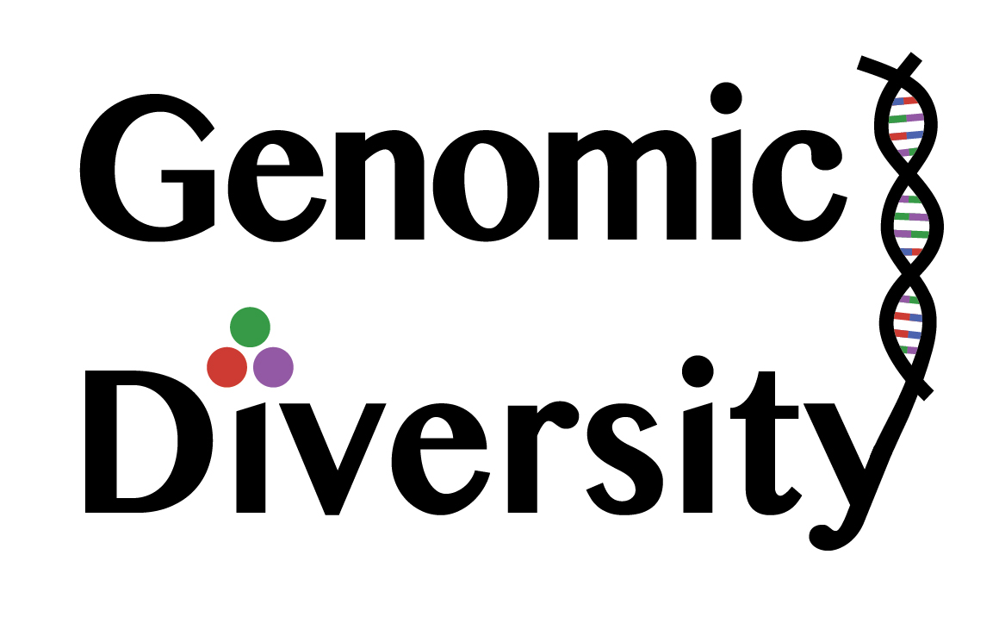

# GreenishWarblerGenomics2025

The scripts, data, and figures shown in this GitHub repository were used as the basis for the paper listed below, which should be cited as the source of information from this website:

**Irwin, D., S. Bensch, C. Charlebois, G. David, A. Geraldes, S.K. Gupta, B. Harr, P. Holt, J.H. Irwin, V.V. Ivanitskii, I.M. Marova, Y. Niu, S. Seneviratne, A. Singh, Y. Wu, S. Zhang, T.D. Price. 2025. The distribution and dispersal of large haploblocks in a superspecies. _Molecular Ecology_, in press.**

Much of the analysis shown in this repo was done in the Julia programming language. If you've never used Julia, you can learn more and easily install for free [here](https://julialang.org).

[{width=15% fig-align=center}](https://julialang.org)

The Julia code here is loosely based on R code written for an earlier Greenish Warbler analysis (Irwin et al. 2016, _Molecular Ecology_), and then the North American warbler analyses (Irwin et al. 2018, _Molecular Ecology_). Since then, I've rewritten the code in Julia, where it is orders of magnitude faster. I've packaged many of the functions into a Julia package, `GenomicDiversity.jl`, that is now officially registered and easily installed (via this command entered into the Julia REPL: `import Pkg; Pkg.add("GenomicDiversity")`). Click on the logo if you want to learn more about this package:

[{width=25% fig-align=center}](https://github.com/darreni/GenomicDiversity.jl)

The analysis scripts provided in this repo are in Quarto Markdown (.qmd) format, which were then rendered to webpages (.html files) that present the scripts in an easily readable way, also showing notes and figures produced by the scripts. Quarto allows the rendering of sets of websites as a single Quarto project, consisting of Quarto notebooks, which can run and display the results of Julia (or other) code blocks, along with text narration, and output in html, pdf, Word, etc. To see the first one and work your way through the analysis, start [here](https://darreni.github.io/GreenishWarblerGenomics2025/)

Copyright 2025, Darren Irwin
